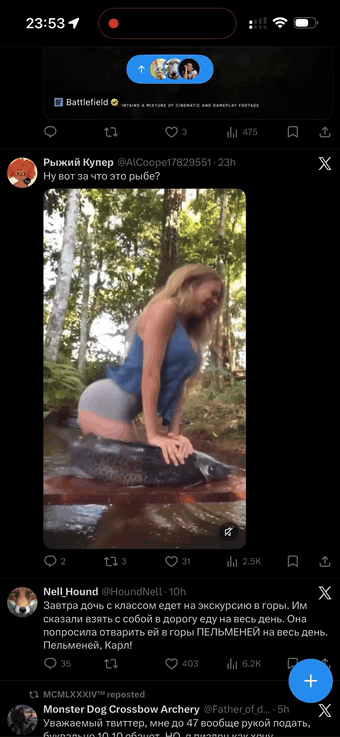

<div align="center">

# 📥 vdl

**Self-hosted video downloader — from the iPhone share menu straight to Photos.**

<p align="center">
  <a href="https://github.com/0x3654/vdl/releases"></a>
  <a href="https://github.com/0x3654/vdl/pkgs/container/vdl"></a>
  <a href="https://go.dev"></a>
  <a href="LICENSE"></a>
</p>

<p align="center">
  <a href="docs/demo.mp4"></a><br>
  <sub>share sheet → <b>vdl</b> → 18 seconds later it's in Photos · <a href="docs/demo.mp4">mp4</a></sub>
</p>

[What it does](#-what-it-does) · [How it works](#-how-it-works) · [Shortcut](#-iphone-shortcut) · [Deploy](#-deploy) · [Cookies via Telegram](#-cookies-via-telegram) · [API](#-api) · [Оглавление по-русски](#-vdl--по-русски)

</div>

## 📥 What it does

Share a video link from any app → run the Shortcut → the video lands in your
Photo library. No ads, no third-party "downloaders", your own VPS, your own
accounts.

- **Photos, quote-chains, galleries**: quote-post links yield the quoted video, multi-level quotes collect every media, photo tweets download as images
- **Twitter/X first-class**: cobalt guest access → [fxtwitter](https://github.com/FixTweet/FxTwitter) (no cookies, NSFW included) → your own account cookies via the GraphQL web API (ported from a battle-tested reader script: queryId rotation, JS-bundle discovery, best-bitrate mp4 selection).
- **~20 more sites through [cobalt](https://github.com/imputnet/cobalt)**: YouTube, Instagram, TikTok, Reddit, Bluesky, VK, Rutube, Twitch, …
- **Redirect-first**: for IP-agnostic CDNs (twimg) the server answers `302` and your phone downloads straight from the CDN — the VPS carries no video bandwidth. IP-bound CDNs (googlevideo, fbcdn) go through cobalt's `/tunnel`.
- **Multi-account cookie manager in Telegram**: paste cookies to the bot, it stores them (0600), rotates LRU, health-checks on a schedule, and asks you for fresh cookies the moment they expire.

## 🙏 Credits & licensing

**The engine of this project is [cobalt](https://github.com/imputnet/cobalt) by
[imput](https://github.com/imputnet)** — thank you for the best self-hostable
media API out there. This repo does not fork or modify it: cobalt runs as an
unmodified upstream container (`ghcr.io/imputnet/cobalt`), and the small Go
service around it only resolves links, manages cookies and serves the
iOS shortcut. cobalt is licensed under **GNU AGPL-3.0** (plain, no additional
terms); its source always lives upstream. If you like what this stack
downloads — star cobalt first.

Also standing on the shoulders of:
- **[fxtwitter / FixTweet](https://github.com/FixTweet/FxTwitter)** — tweet
  metadata (and NSFW posts) without cookies.

## ⚙️ How it works

```
iPhone share menu → Shortcut GET https://vdl.example.com/dl?token=…&url=<link>
  nginx (TLS) ─┬─ /dl, /, /healthz → vdl keeper (Go)
               └─ /tunnel/*        → cobalt (localhost)

keeper resolves the link:
  other:   cobalt
answer: 302 to the CDN, or 302 to cobalt's /tunnel for IP-bound media
```

The keeper is a single Go binary (scratch docker image, no dependencies beyond
resolve cache, SSRF checks on redirect targets, and a Telegram long-poll bot
for cookie management. cobalt runs unmodified as a separate container; the
keeper materializes `cookies.json` for it (arrays = built-in rotation) and a
cron restarts cobalt when the file changes.

## 📱 iPhone Shortcut

One-time setup (7 actions), downloads everything a post contains — videos,
photos, quote-post media, galleries — each as its own file:

1. **Receive URLs from Share Sheet** (input: URLs only)
2. **If** [Shortcut Input] *has no value* → **Show Notification** "no link" → **Stop This Shortcut**
3. **Get Contents of URL**:
   `https://vdl.example.com/dl?token=<your_token>&list=1&url=[Shortcut Input]`
4. **Get Dictionary Value** for `medias`
5. **Repeat with Each**: **Get Contents of URL** [Repeat Item] → **Save to Photo Album**
6. After the repeat: **Show Notification** "Saved ✓"
7. Shortcut settings (ⓘ): turn **Show When Run** off — runs quietly from the share sheet

The guard in step 2 keeps failed runs from saving error bodies as photos;
error responses are non-2xx so *Get Contents* aborts the run.

## 🚀 Deploy

Requires: a Linux host with docker + nginx, a domain pointing at it, and a
Telegram bot token ([@BotFather](https://t.me/BotFather)).

```bash
git clone https://github.com/0x3654/vdl && cd vdl
docker compose up -d          # cobalt + vdl, localhost only
curl 'http://127.0.0.1:8360/healthz'
```

Behind your own TLS reverse proxy, route `/dl`, `/`, `/healthz` to `:8360`
and `/tunnel/` to cobalt `:9000` (cobalt needs `API_URL=https://vdl.example.com/`
for tunnel links to be valid).

Environment (all optional except `TOKEN`):

| Var | Default | Meaning |
|---|---|---|
| `TOKEN` | — (required) | access token for `/dl` and `/admin` |
| `PORT` | `8360` | listen port |
| `DATA_DIR` | `/data` | state volume (accounts, queryId cache) |
| `COBALT_URL` | `http://127.0.0.1:9000` | cobalt instance |
| `TG_BOT_TOKEN` | — | empty = bot and checker disabled |
| `TG_ADMIN_CHATS` | — | admin chat ids (group + private), comma-separated |
| `COOKIES_OUT` | — | where to materialize cobalt's `cookies.json` |
| `CHECK_INTERVAL` | `12h` | cookie health-check period (`0` disables) |
| `RESOLVE_TIMEOUT` | `30s` | per-request resolve budget |

## 🍪 Cookies via Telegram

Add the bot to a private supergroup (or chat with it directly), whitelist the
chat id in `TG_ADMIN_CHATS`, then:

| Command | Does |
|---|---|
| `/add [site] [label]` | then paste cookies in any format: header `auth_token=…; ct0=…`, JSON, `k=v` lines, or two bare values |
| `/accounts` | list with 🟢/🔴 status and last check time |
| `/check [site] [label]` | probe right now |
| `/del [site] [label]` | remove |

Expired cookies get 🔴, the group gets an alert with renewal instructions,
and pasting fresh cookies under the same label reactivates the account.
Only cookie *names* ever appear in logs and the admin API — never values.

> [!NOTE]
> cobalt is AGPL-3.0; this repo ships only the keeper and talks to cobalt
> over its HTTP API. The cobalt container is used unmodified.

## 🔌 API

| Endpoint | |
|---|---|
| `GET /dl?token=…&url=…[&list=1][&index=N]` | `302` to the media (or `index`-th), `list=1` → JSON with all medias (quotes/galleries); errors: `400` bad url, `422` no media, `429` rate limited, `502` upstream, `503` cookies dead |
| `GET /healthz` | liveness + account counters |
| `GET /admin/accounts?token=…` | account list without secrets |

## 🇷🇺 vdl — по-русски

**Self-hosted загрузчик видео: из меню «Поделиться» на айфоне — сразу в галерею Фото.**

Поделился ссылкой → шорткат → видео в Фото. Без рекламы и сторонних
«скачивалок», на своём VPS и своих аккаунтах.

- **Твиттер в три слоя**: cobalt без кук → fxtwitter (без кук, NSFW) → GraphQL
  под куками твоих аккаунтов (порт читающего скилла: ротация queryId,
  вытаскивание свежих из JS-бандлов, mp4 с максимальным битрейтом).
- **Ещё ~20 сайтов через cobalt**: YouTube, Instagram, TikTok, Reddit, Bluesky,
  VK, Rutube, Twitch…
- **Сначала редирект**: для CDN без привязки к IP (twimg) сервер отвечает `302`,
  телефон качает напрямую с CDN — VPS не тащит видеотрафик. Привязанные к IP
  (googlevideo, fbcdn) идут через `/tunnel` cobalt.
- **Куки-менеджер в Telegram**: вставил куки боту — он сохранил (0600), крутит
  LRU-ротацией, проверяет по расписанию и просит свежие, когда протухли.
  домашний сервер — домашние IP «верят, что ты смотришь», датацентровые банят.

**Шорткат** (один раз): «Получить URL из Поделиться» → «Получить содержимое
URL» `https://vdl.example.com/dl?token=<токен>&url=[Shortcut Input]` →
«Сохранить в альбом Фото».

**Деплой**: `docker compose up -d`, за своим TLS-прокси (`/dl`→`:8360`,
`/tunnel/`→`:9000`, у cobalt `API_URL=https://…`), переменные — в таблице
выше. Куки — боту: `/add twitter main`, вставить `auth_token=…; ct0=…`,
дальше `/accounts` покажет состояние; протухли — бот сам попросит новые.

Подробности — в английской части выше (таблицы API и env совпадают).

## 🙏 Благодарности и лицензии

**Движок этого проекта — [cobalt](https://github.com/imputnet/cobalt) от
[imput](https://github.com/imputnet)** — спасибо за лучший селф-хостед
медиа-API. Мы не форкаем и не модифицируем его: cobalt работает отдельным
немодифицированным контейнером (`ghcr.io/imputnet/cobalt`), а наша небольшая
Go-обвязка только резолвит ссылки, управляет куками и раздаёт iOS-шорткат.
cobalt под **GNU AGPL-3.0** (чистой, без допусловий), исходники всегда
лежат апстримом. Понравилось, что качает, — поставь звезду сначала им.

Опираемся также на:
- **[fxtwitter / FixTweet](https://github.com/FixTweet/FxTwitter)** — метаданные
  твитов (и NSFW) без кук.


## ⚖️ License

MIT © 0x3654 for this repository's code. cobalt is a separate work under
GNU AGPL-3.0, used unmodified — see [Credits](#-credits--licensing).
